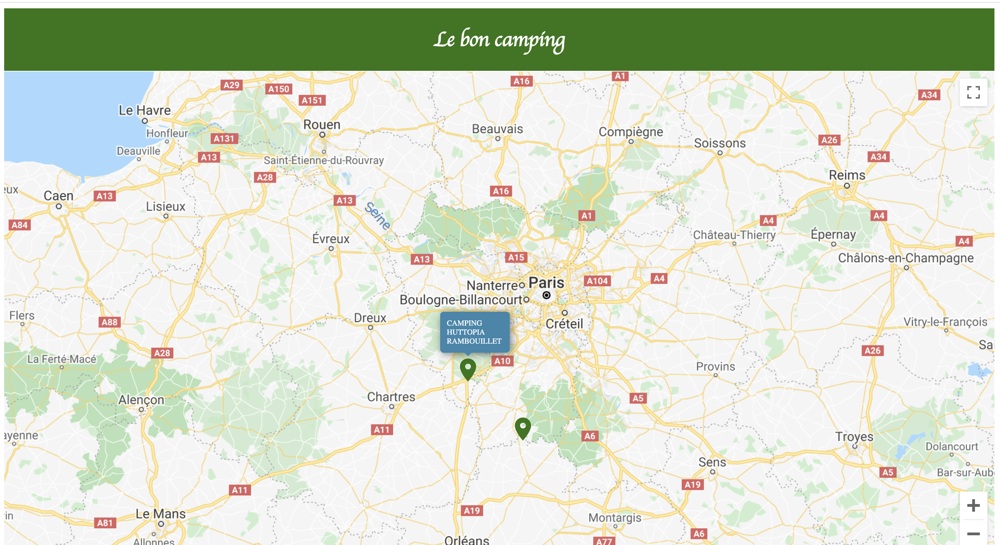
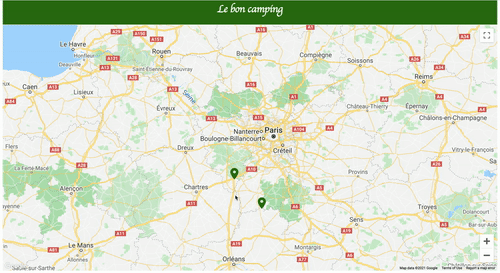
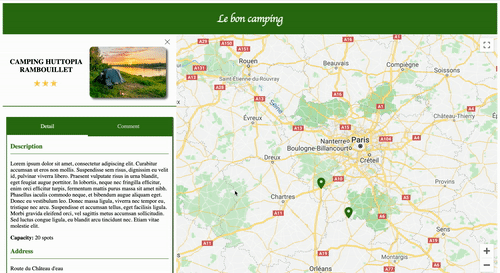
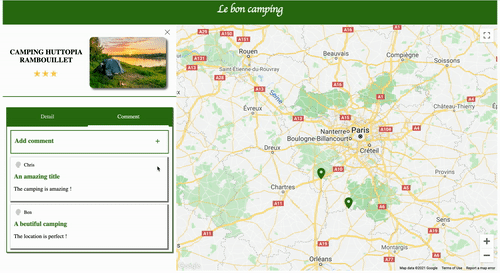
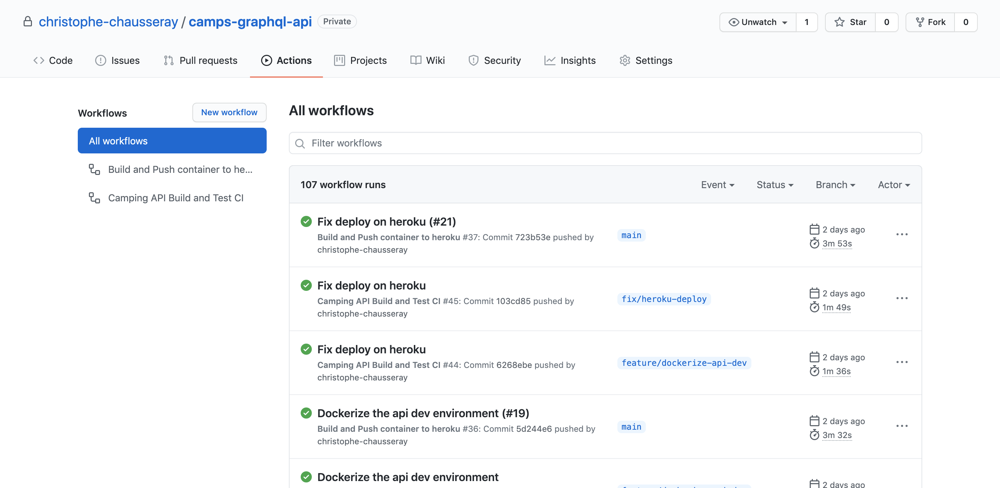

<h3 align="center">
  Camps React Application
</h3>

<p align="center">
  <a href="https://reactjs.org/">React Application</a>
  using <a href="https://www.apollographql.com/docs/react/">Apollo Client</a>,
  built with <a href="https://en.wikipedia.org/wiki/Continuous_integration">CI</a>.
</p>

> The goal of this React Application is to display all the campings around Paris with their information details and comments.
> You can have access to the Application here [christophe-chausseray.github.io/camps-react-app/](https://christophe-chausseray.github.io/camps-react-app/)

<p align="center">
  <a href="#getting-started">Getting Started</a> •
  <a href="#feature">Feature</a> •
  <a href="#built-with">Built With</a> •
  <a href="#build">Build</a> •
  <a href="#tests">Tests</a> •
  <a href="#ci-and-deployment">CI and Deployment</a> •
  <a href="#license">License</a>
</p>

## <a name="getting-started"></a> Getting Started
### Prerequisites

To install and run the Application you need to have [NodeJS](https://nodejs.org/en/download/).

### Installation
Clone the project, make the  installation and run the application:

```bash
https://github.com/christophe-chausseray/camps-react-app.git
cd camps-react-app
make install
yarn start
```
Your application should succesfully runs locally.

You can now access to your local Camps application on [http://localhost:3000/](http://localhost:3000/) to use the application.

P.S : As the application using [Google Maps API](https://developers.google.com/maps/documentation/javascript/get-api-key) you should update the environment variable `REACT_APP_GOOGLE_MAP_API_KEY` in your .env file :
```.env
REACT_APP_GOOGLE_MAP_API_KEY=secret
REACT_APP_CAMPS_API_HOST=http://localhost:3000
```

## <a name="feature"></a> Feature

Display camping markers on a google map



Display the camping information in the sidebar on the left of the screen when clicking on the marker



Display the list of comments for the camping in the sidebar



Add a new comment for the camping



P.S : You should see only 2 markers on the map. That's normal ! It's because the application using [MSW](https://mswjs.io/) locally and for the test environment.
So, **the server side is mocked locally by MSW** and return only 2 campings.

## <a name="built-with"></a> Built with

- [Create React App](https://create-react-app.dev/)
- [Google Maps Platform](https://developers.google.com/maps)
- [Apollo Client](https://www.apollographql.com/docs/react/)
- [MSW](https://mswjs.io/)
- [React Testing Library](https://testing-library.com/docs/react-testing-library/intro/)
- [Cypress](https://www.cypress.io/)

## <a name="build"></a> Build

If you want to build your application in production environment, you need to run :
```bash
yarn build
```

## <a name="tests"></a> Tests

This API is automated tested following the [Test Pyramid](https://martinfowler.com/articles/practical-test-pyramid.html) : Unit tests, Integration tests and End-to-End tests.

Those tests can be run with :
```bash
yarn test
```

## <a name="ci-and-deployment"></a> CI and Deployment

This project handles the CI and deployment with [Github Actions](https://github.com/features/actions) on [Github Pages](https://pages.github.com//).



The build and deploy workflows can be found in the `.github/workflows/` directory.

The CI build will be run on the branch following the pattern `feature/**` or `fix/**`.
It will execute the linter and the test to check if the code is following the coding style of the application and if it doesn't break anything.

## <a name="license"></a> License

[MIT](https://opensource.org/licenses/MIT)

> Christophe Chausseray &nbsp;&middot;&nbsp;
> [Linkedin](https://www.linkedin.com/in/christophe-chausseray-10672140/)


